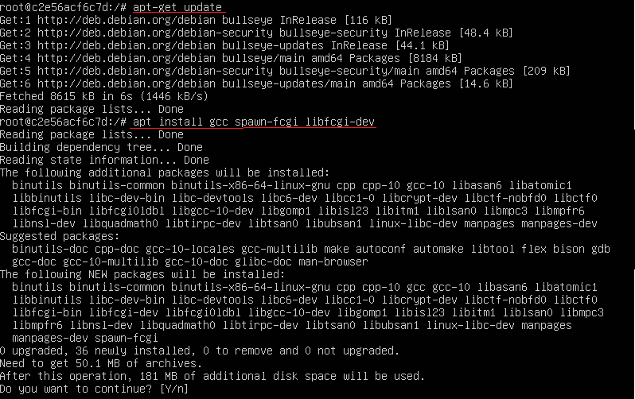

# Simple Docker

## Part 1. Готовый докер

##### При помощи `docker pull` скачали официальный образ с **nginx**.

##### Проверили наличие докер образа через `docker images`, запустили при помощи `docker run -d [image_id|repository]` и проверили, что запустилось через `docker ps`.

##### Посмотрели информацию о контейнере через `docker inspect [container_id|container_name]` переместив вывод команды в docker_inspect.

##### По выводу команды определили:
`Размер контейнера`

`Список замапленных портов и ip контейнера`

##### Остановили докер образ через `docker stop [container_id|container_name]`, проверили, что образ остановился через `docker ps`.

##### Запустили докер с замапленными портами 80 и 443 на локальную машину через команду *run* и проверили, что в браузере по адресу *localhost:80* доступна стартовая страница **nginx**.

##### Перезапустили докер контейнер через `docker restart [container_id|container_name]`и проверили с помощью `docker ps`, что контейнер запустился.

## Part 2. Операции с контейнером

Докер образ и контейнер готовы. Теперь можно покопаться в конфигурации **nginx** и отобразить статус страницы.

**== Задание ==**

##### Прочитали конфигурационный файл *nginx.conf* внутри докер контейнера через команду *exec*.

##### Создали на локальной машине файл *nginx.conf*. Настроили в нем по пути */status* отдачу страницы статуса сервера **nginx**.

##### Скопировали созданный файл *nginx.conf* внутрь докер образа через команду `docker cp`. Перезапустили **nginx** внутри докер образа через команду *exec*. Проверили, что по адресу *localhost:80/status* отдается страничка со статусом сервера **nginx**.

##### Экспортировали контейнер в файл *container.tar* через команду *export*. Остановили контейнер. Удалили образ через `docker rmi [image_id|repository]`, не удаляя перед этим контейнеры.

##### Удалили остановленный контейнер. Импортировали контейнер обратно через команду *import*. Запустили импортированный контейнер. Проверили, что по адресу *localhost:80/status* отдается страничка со статусом сервера **nginx**.

## Part 3. Мини веб-сервер

##### Написала мини сервер на **C** и **FastCgi**, который будет возвращать простейшую страничку с надписью `Hello World!`.

##### Написала nginx.conf который будет проксировать запросы с 81 порта на 127.0.0.1:8000.

##### Запустила докер с замапленным портом 81.

##### Скопировала server.c и nginx.conf в докер.

##### Получила доступ к запущенному контейнеру с помощью команды `docker exec -it container_id bash` и проверила наличие файла nginx.conf `cat /etc/nginx/nginx.conf`.

##### Проверила наличие файла server.c `cat /home/server.c`.

##### Для компиляции server.c установили gcc, spawn-fcgi и libfcgi-dev
`apt-get update / apt-get install gcc spawn-fcgi libfcgi-dev`.

##### Скомпилировала server.c `gcc /home/server.c -lfcgi -o server` и запустила написанный мини сервер через *spawn-fcgi* на порту 8080 `spawn-fcgi -p 8080 ./server`. Перезапустила nginx `nginx -s reload`. Проверила, что в браузере по *localhost:81* отдается написанная страничка `curl localhost:81`.

## Part 4. Свой докер

#### Написала свой докер файл `nano Docker`, который копирует в контейнер небходимые файлы, запускает команды установки, присвоения прав доступа и скрипт.

#### Написала скрипт для Dockerfile `nano commands.sh`, который содержит команды для компиляции, запускает написанный мини сервер на 8080 порту и запускает **nginx**.

##### Собрала написанный докер образ через `docker build` при этом указав имя и тег.

##### Проверила через `docker images`, что все собралось корректно.

##### Запустила собранный докер образ с маппингом 81 порта на 80 на локальной машине и маппингом папки *./nginx* внутрь контейнера по адресу, где лежат конфигурационные файлы **nginx**.

##### Проверила, что по *localhost:80* доступна страничка написанного мини сервера.

##### Дописала в *./nginx/nginx.conf* проксирование странички */status*, по которой надо отдавать статус сервера **nginx**.

##### Проверила, что по *localhost:80/status* отдается страничка со статусом **nginx**.

## Part 5. **Dockle**

##### Установила утилиту Dockle `https://habr.com/ru/company/timeweb/blog/561378/`.

##### Просканировала образ из предыдущего задания через `dockle [image_id|repository]`.

##### Исправила образ так, чтобы при проверке через **dockle** не было ошибок и предупреждений `dockle -ak NGINX_GPGKEY docker:test`.

## Part 6. Базовый **Docker Compose**

##### Написала файл *docker-compose.yml* `nano docker-compose.yml` и замапила 8080 порт второго контейнера на 80 порт локальной машины.

##### Подняла докер контейнер с **nginx**, который будет проксировать все запросы с 8080 порта на 81 порт первого контейнера.

##### Собрала проект с помощью команды `docker-compose build`.

##### Проверила, что контейнеры собраны.

##### Запустила проект с помощью команды `docker-compose up`. Проверила, что контейнеры запущены. Проверила, что по *localhost:80* отдается написанная страничка.

